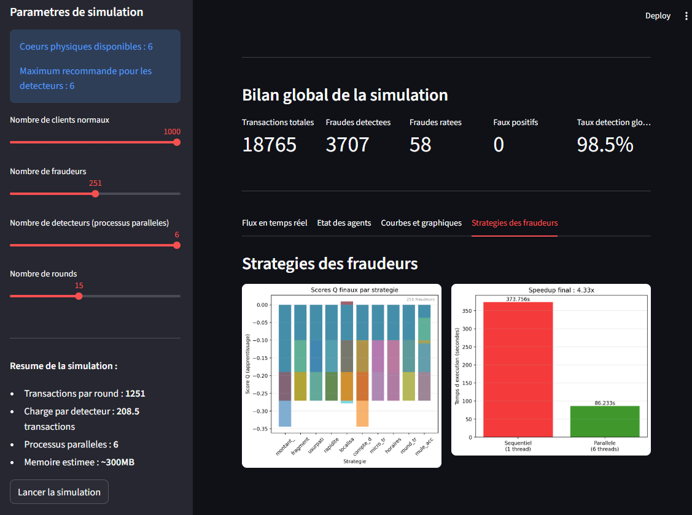

# Real-time fraud detection with parallel agents

Academic project for the Parallel Architecture course of my Master's in Artificial Intelligence.

It simulates a stream of banking transactions in FCFA. Normal clients make ordinary payments, fraudsters try to slip fraudulent ones through, and several detectors analyse the stream at the same time, each in its own process. The fraudsters learn from their failures: a strategy that keeps getting caught is used less and less.

The interesting part for the course was the parallelism. The transactions of each round are split between processes with `multiprocessing`, so the analysis really runs on several CPU cores, and the app compares that with a single-process run.



## Why it matters

In Côte d'Ivoire and across West Africa, a large share of payments goes through mobile money. Operators and banks fighting fraud face the same three constraints this project reproduces:

- decisions have to be made in real time, on a very large volume of transactions, which is why the work is spread over several processes
- fraudsters adapt: when a technique gets blocked, they switch to another one, which the Q-learning agents imitate
- blocking a legitimate client has a cost too, so false positives matter as much as missed frauds

The fraud techniques in the simulation (money mules, splitting amounts, identity theft, night transfers...) are the ones commonly reported in mobile money fraud.

## How it works

Each round goes like this:

1. Every client and every fraudster produces a transaction. They are shuffled into one stream.
2. The stream is split into equal parts, one per detector, and each part is analysed in a separate process.
3. The main process collects the decisions, computes the metrics and lets the fraudsters learn.

**Fraudsters** pick between 10 strategies taken from real fraud cases: one huge transfer, splitting a large amount into small payments, copying a real client's profile, bursts of transactions, night-time transfers, money mules, round tripping, and so on. They learn with a simplified Q-learning (epsilon-greedy, 20% exploration).

**Detectors** give each transaction a risk score from 0 to 100, built from ten business rules (amount, frequency, time of day, change of city, same client id seen twice in a round...). A transaction is blocked from a score of 30.

**SQLite** keeps the usual city of each client between simulations, so detectors start the next run with what they learned. It also stores every fraud attempt and the summary of each simulation.

## Why rules and not machine learning

I first tried to replace the rules with machine learning models, including XGBoost trained on 50,000 simulated transactions (code in `ml/`). Offline the model looked excellent. Inside the simulation, it let a lot more fraud through than the rules did, so I kept the rule-based detector.

Looking back, part of the reason is the training data: during generation the fraudsters don't learn yet, so about 80% of the fraud cases use the same easy strategy. The model learned that case well and generalised poorly to fraudsters who adapt.

## Results

Over my last 25 simulations (between 1,500 and 13,000 transactions each, 166,226 in total):

- **98.4% of frauds detected** (49,319 out of 50,134), between 97.5% and 98.8% depending on the run
- **no false positive**: no normal client was blocked

Detection by strategy:

| Strategy | Detected |
| --- | --- |
| Fragmentation, bursts, micro-transactions, night transfers, huge transfer, round tripping, identity theft | 100% |
| Dormant account | 98.3% |
| Money mule | 95.6% |
| Impossible location | 90.2% |

These numbers say how well the rules handle *this* simulator. I calibrated the rules knowing how the simulated clients behave, so they don't measure performance on real banking data.

For comparison, the first versions of the detector, based on adaptive thresholds, caught only 26 to 52% of the frauds.

The final Q-scores of the fraudsters tell the same story. Almost all of them are negative, meaning no strategy really pays off. The few positive scores are on impossible location and money mules, the two weakest points of the rules in the table above: the fraudsters found them on their own.

### Parallel speedup

Measured on Windows with 6 physical cores, on rounds of 1,251 transactions:

| Processes | Sequential | Parallel | Speedup | Efficiency |
| --- | --- | --- | --- | --- |
| 4 | 375 s | 121 s | 3.1x | 77% |
| 6 | 374 s | 86 s | 4.3x | 72% |

Efficiency drops a little as processes are added, as Amdahl's law predicts. From these two runs, about 8 to 10% of the work stays sequential (splitting the round, sending transactions to the processes, collecting the results), which caps the speedup around 10 to 13x whatever the number of cores.

One thing to keep in mind: the rules themselves take a few microseconds per transaction. To make the parallelism measurable, each analysis also runs a deliberate CPU load (about a million square roots), standing in for the cost of real checks such as signature verification or database lookups. Without it, the parallel version would be slower than the sequential one.

## Project structure

```
app.py                 Streamlit interface
agents/
    client.py          normal client
    fraudeur.py        fraudster (10 strategies, Q-learning)
    detecteur.py       detector (risk score from 10 rules)
    superviseur.py     metrics and learning after each round
core/
    simulation.py      parallel engine (multiprocessing.Pool)
    base_donnees.py    SQLite persistence
ml/                    XGBoost experiment, not used by the simulation
scripts/check_db.py    prints the history of simulations
data/                  database and dataset, created automatically
docs/                  screenshots
models/                XGBoost model, created by the ml/ scripts
```

## Run it

```bash
python -m venv venv
venv\Scripts\activate          # on Linux/Mac: source venv/bin/activate
pip install -r requirements.txt
streamlit run app.py
```

Or with Docker:

```bash
docker compose up --build
```

The app is then at http://localhost:8501.

The ML scripts and the history script are run as modules, from the project root:

```bash
python -m ml.generer_dataset
python -m ml.modele_detection
python -m scripts.check_db
```

## Tools

Python, multiprocessing, Streamlit, SQLite, matplotlib, D3.js for the animation, Docker. XGBoost and scikit-learn for the ML experiment.
